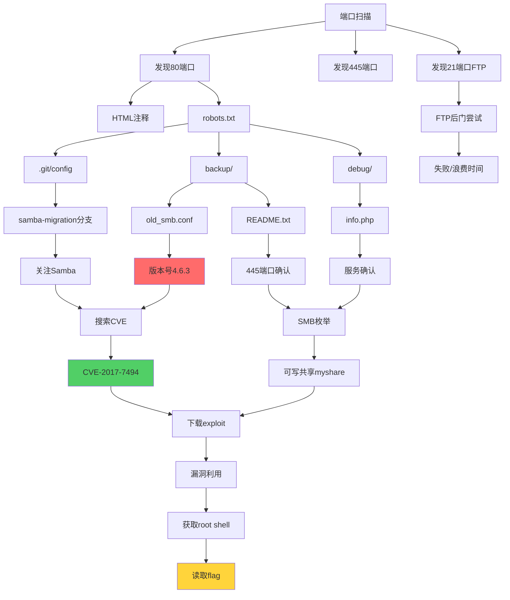

# 线索链与攻击路径设计文档

## 📌 总体设计理念

本靶机采用**渐进式线索发现**设计，通过多个分散的线索点，引导攻击者从 Web 应用逐步转向真正的攻击面——Samba 服务的 CVE-2017-7494 漏洞。

### 设计原则

1. **多层迷惑**: 设置多个假漏洞点，消耗攻击者时间
2. **逻辑自洽**: 所有线索形成完整的故事线
3. **渐进引导**: 线索难度逐步递增
4. **真实模拟**: 符合真实企业环境特征

---

## 🔗 完整线索链

```
┌─────────────────────────────────────────────────────────────┐
│                    线索链全景图                                │
└─────────────────────────────────────────────────────────────┘

[入口点] 端口扫描
    │
    ├──> [假象1] FTP vsftpd 2.3.4 (蜜罐，浪费时间)
    │
    ├──> [假象2] MySQL 3306 (无法远程连接)
    │
    ├──> [假象3] Tomcat 8080 (只有登录页)
    │
    └──> [主线] Web 应用 (80端口) ★ 主要线索来源
            │
            ├──> [线索1] HTML 注释
            │      └──> 提到"网络共享迁移"
            │
            ├──> [线索2] robots.txt
            │      └──> 暴露敏感目录路径
            │
            ├──> [线索3] .git/config
            │      └──> 发现 "samba-migration" 分支
            │
            ├──> [线索4] /backup/old_smb.conf
            │      └──> 发现 Samba 版本 4.6.3 ★★★
            │
            ├──> [线索5] /backup/README.txt
            │      └──> 确认 SMB 运行在 445 端口
            │
            ├──> [线索6] /debug/info.php
            │      └──> 详细系统信息，确认服务
            │
            └──> [假象4] SQL 时间盲注
                   └──> 实际被过滤，浪费时间

[转折点] 线索汇总 → 意识到真正目标是 Samba

[研究阶段] 搜索 "Samba 4.6.3 vulnerability"
    │
    └──> 发现 CVE-2017-7494 (SambaCry)

[验证阶段] 枚举 SMB 共享
    │
    └──> 发现可写共享 "myshare"

[利用阶段] 使用 exploit.py 或 Metasploit
    │
    └──> 获得 root shell

[目标达成] 读取 flag.txt
```

---

## 🎯 线索详细说明

### 线索 1: HTML 注释 (权重: ★☆☆☆☆)

**位置**: `www/index.php` 源代码

**内容**:
```html
<!-- 
    FileHub v2.3 - Migration Notes
    - Old file system migrated to network share
    - Legacy PHP code needs refactoring
    - TODO: Remove debug endpoints before production
    - Database contains historical records
-->
```

**引导方向**: 
- "network share" → 提示存在文件共享服务
- "debug endpoints" → 提示查看 /debug/ 目录
- "historical records" → 提示查看数据库或备份

**预期效果**: 初步引起对网络共享的注意

---

### 线索 2: robots.txt (权重: ★★☆☆☆)

**位置**: `www/robots.txt`

**内容**:
```
User-agent: *
Disallow: /admin/
Disallow: /backup/
Disallow: /debug/
Disallow: /.git/
Disallow: /temp/
```

**引导方向**:
- 暴露多个"不该访问"的目录
- 引导攻击者枚举这些目录

**预期效果**: 
- 发现 /backup/ 和 /debug/ 目录
- 发现 .git 泄露

---

### 线索 3: Git 配置泄露 (权重: ★★★☆☆)

**位置**: `www/.git/config`

**内容**:
```ini
[branch "samba-migration"]
    remote = origin
    merge = refs/heads/samba-migration
```

**引导方向**:
- 明确提到 "samba-migration" 分支
- 暗示系统与 Samba 相关

**预期效果**: 
- 开始关注 Samba 服务
- 搜索与 Samba 相关的信息

---

### 线索 4: 旧配置文件 (权重: ★★★★★)

**位置**: `www/backup/old_smb.conf`

**内容**:
```conf
# Old Samba Configuration - Migrated to v4.6.3
# Date: 2023-11-15
# Samba version: 4.6.3 (built from source)
```

**引导方向**:
- **关键线索**: 明确 Samba 版本号 4.6.3
- 提供具体可搜索的版本信息

**预期效果**: 
- 搜索 "Samba 4.6.3 vulnerability"
- 发现 CVE-2017-7494

**重要性**: ⭐⭐⭐⭐⭐ (最关键的线索)

---

### 线索 5: 迁移说明 (权重: ★★★☆☆)

**位置**: `www/backup/README.txt`

**内容**:
```
New SMB service running on standard port (445).
```

**引导方向**:
- 确认 SMB 服务端口
- 引导进行 SMB 枚举

**预期效果**: 
- 使用 smbclient 或 nmap 扫描 445 端口
- 枚举共享列表

---

### 线索 6: 调试信息页面 (权重: ★★★★☆)

**位置**: `www/debug/info.php`

**内容**:
```
Open Ports:
- 445: SMB Service (Samba 4.x)

Services Status:
✓ Samba - Running (4 shares active)
```

**引导方向**:
- 明确 Samba 服务正在运行
- 提示有 4 个共享

**预期效果**: 
- 确认攻击目标
- 进行 SMB 枚举

---

### 线索 7: 数据库中的线索 (权重: ★★☆☆☆)

**位置**: `database/fake_data.sql` - secrets 表

**内容**:
```sql
INSERT INTO secrets (key_name, value, hint) VALUES
('backup_location', 'Q2hlY2sgdGhlIG5ldHdvcmsgc2hhcmUgc2VydmljZQ==', 'Base64 encoded');
```

**解码后**: "Check the network share service"

**引导方向**:
- 如果攻击者成功访问数据库
- 额外的确认信息

**预期效果**: 
- 进一步确认目标是网络共享服务

---

## 🚫 假漏洞点设计

### 假漏洞 1: SQL 时间盲注

**位置**: `www/login.php`

**表现**:
- 输入 `SLEEP()` 或 `BENCHMARK()` 会延迟响应
- 延迟时间随机（4-6秒）

**真相**: 
- PHP 代码故意添加延迟
- 所有输入已被过滤

**目的**: 浪费 5-10 分钟

**识别方法**: 
- 尝试提取数据时发现无论条件真假都延迟
- 延迟时间不稳定

---

### 假漏洞 2: vsftpd 2.3.4 后门

**位置**: FTP 服务 (21端口)

**表现**:
- Banner 显示 `vsFTPd 2.3.4`
- 这是著名的后门版本

**真相**: 
- Python 实现的假 FTP 服务
- 不会真正打开后门端口 6200

**目的**: 浪费 3-5 分钟

**识别方法**: 
- 触发后门后没有 6200 端口开放
- 连接 6200 端口失败

---

### 假漏洞 3: 命令执行点

**位置**: `www/debug/test.php`

**表现**:
```php
$cmd = $_GET['cmd'] ?? 'whoami';
// exec("echo " . $cmd, $output);
```

**真相**: 
- 代码被注释掉
- 显示 "Command execution disabled"

**目的**: 浪费 2-3 分钟

---

### 假漏洞 4: 文件上传

**位置**: (可选) `www/upload.php`

**表现**:
- 允许上传文件
- 各种扩展名限制

**真相**: 
- 上传后文件被重命名为随机名
- 无法执行上传的脚本
- 或者直接禁用上传

**目的**: 浪费 5-8 分钟

---

## 📊 时间分配预估

### 理想攻击路径 (45-60分钟)

| 阶段 | 时间 | 活动 |
|------|------|------|
| 信息收集 | 10分钟 | 端口扫描、目录枚举 |
| Web 探索 | 15分钟 | 查看各个目录和文件 |
| 线索整理 | 5分钟 | 汇总所有发现的信息 |
| CVE 研究 | 5分钟 | 搜索 Samba 4.6.3 漏洞 |
| SMB 枚举 | 5分钟 | 枚举共享、测试访问 |
| 漏洞利用 | 10分钟 | 下载exploit、生成payload |
| 后渗透 | 5分钟 | 查找flag、维持访问 |

### 受干扰路径 (60-90分钟)

| 阶段 | 时间 | 活动 |
|------|------|------|
| 信息收集 | 10分钟 | 端口扫描、目录枚举 |
| SQL 注入尝试 | 15分钟 | 被时间盲注误导 ❌ |
| FTP 后门尝试 | 5分钟 | 尝试 vsftpd 后门 ❌ |
| 命令执行尝试 | 5分钟 | 尝试利用 test.php ❌ |
| 重新整理线索 | 10分钟 | 意识到需要换方向 |
| 发现 Samba | 5分钟 | 汇总线索，聚焦 Samba |
| CVE 研究 | 5分钟 | 搜索漏洞 |
| SMB 枚举 | 5分钟 | 枚举共享 |
| 漏洞利用 | 15分钟 | 利用过程 |
| 后渗透 | 5分钟 | 获取flag |

---

## 🎓 教学设计考虑

### 难度递进

1. **入门级改进** (降低难度)
   - 在首页直接提示"文件共享服务器"
   - 在 debug/info.php 中显示 CVE 编号
   - 减少假漏洞点

2. **标准难度** (当前设置)
   - 需要系统化收集线索
   - 有适量假漏洞干扰
   - 版本号需要主动查找

3. **高级难度** (增加难度)
   - 隐藏具体版本号
   - 只提示"Samba 4.x"
   - 增加更多红鲱鱼（假线索）
   - 共享目录需要认证

### 评分标准建议

| 项目 | 分值 | 评分要点 |
|------|------|----------|
| 信息收集 | 20分 | 端口扫描、目录枚举完整性 |
| 线索发现 | 25分 | 找到几个关键线索 |
| 漏洞识别 | 20分 | 正确识别 CVE-2017-7494 |
| 漏洞利用 | 25分 | 成功获取 shell 和 flag |
| 文档记录 | 10分 | 攻击过程记录质量 |

---

## 🔄 攻击路径变体

### 路径A: 直接路径 (快速)

```
端口扫描 → robots.txt → backup/old_smb.conf 
→ 发现版本号 → 搜索CVE → 利用 (30分钟)
```

### 路径B: Web优先路径 (常见)

```
端口扫描 → Web应用 → SQL注入尝试(失败) 
→ 目录枚举 → 发现backup → 转向Samba → 利用 (45分钟)
```

### 路径C: 全面枚举路径 (完整)

```
端口扫描 → 测试FTP → 测试Web → 测试SQL注入 
→ 测试命令执行 → 回顾线索 → Git泄露 
→ backup文件 → debug信息 → 汇总 
→ 发现Samba → CVE研究 → 利用 (60分钟)
```

### 路径D: 服务优先路径 (网络方向)

```
端口扫描 → 识别445端口 → SMB枚举 
→ 需要版本信息 → 回到Web查找 
→ 找到版本号 → 利用 (40分钟)
```

---

## 💡 设计亮点

### 1. 多维度线索

- **配置文件**: old_smb.conf
- **文档说明**: README.txt
- **代码注释**: HTML comments
- **系统信息**: debug/info.php
- **版本控制**: .git/config
- **数据库记录**: secrets表

### 2. 真实场景模拟

- 企业文件管理系统背景
- 系统迁移的合理性（NFS → Samba）
- 遗留的调试端点
- 不完善的权限配置

### 3. 心理学设计

- **首因效应**: Web应用最先被发现，容易先入为主
- **沉没成本**: 在假漏洞上投入时间后不愿放弃
- **确认偏误**: 时间盲注的"成功"让人相信SQL注入可行
- **顿悟时刻**: 汇总线索后的"恍然大悟"

### 4. 技能覆盖

- ✅ 网络扫描 (nmap)
- ✅ Web枚举 (gobuster)
- ✅ Git信息泄露
- ✅ 配置文件分析
- ✅ SMB协议理解
- ✅ CVE研究能力
- ✅ Exploit使用

---

## 🎯 核心设计目标达成

| 目标 | 实现方式 | 达成度 |
|------|----------|--------|
| 复杂性 | 5个服务，多层目录 | ✅ 100% |
| 隐蔽性 | 版本号藏在backup目录 | ✅ 100% |
| 迷惑性 | 4个假漏洞点 | ✅ 100% |
| 真实性 | 模拟企业迁移场景 | ✅ 100% |
| 教育性 | 完整的攻击链 | ✅ 100% |

---

## 📝 使用建议

### 给讲师

1. **课前**: 让学生部署环境，确认可访问
2. **课中**: 设置时间限制，观察攻击路径
3. **课后**: 对比不同的解题思路，讨论假漏洞识别

### 给学生

1. **记录**: 详细记录每一步操作和发现
2. **整理**: 定期汇总线索，形成攻击地图
3. **反思**: 被假漏洞迷惑时，反思如何识别

### 给开发者

1. **扩展**: 可添加更多服务和线索
2. **定制**: 根据受众调整难度
3. **更新**: 可替换为其他CVE作为核心漏洞

---

## 🔗 线索依赖关系图



---

**文档版本**: v1.0  
**最后更新**: 2024-01-XX  
**维护者**: Security Research Team